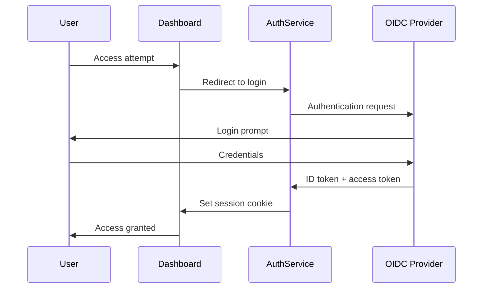

# RadixInsight: Security & Privacy Measures

This document outlines the comprehensive security and privacy measures implemented for the RadixInsight platform to ensure data protection, regulatory compliance, and secure operations.

## 1. Authentication & Authorization

### 1.1 Authentication Framework

RadixInsight will implement a multi-layered authentication system:

#### User Authentication



1. **Primary Authentication Method**: OpenID Connect (OIDC) integration with organizational identity provider
   - Support for Azure AD, Google Workspace, or Okta
   - Single Sign-On (SSO) capability
   - Multi-factor authentication (MFA) enforcement

2. **Service Account Authentication**:
   - API key-based authentication for server-to-server communication
   - JWT (JSON Web Tokens) with short expiration times
   - Certificate-based mutual TLS for critical services

3. **Implementation Details**:
   ```typescript
   // Auth middleware example (Node.js/Express)
   import { expressjwt } from 'express-jwt';
   import jwksRsa from 'jwks-rsa';
   
   const checkJwt = expressjwt({
     secret: jwksRsa.expressJwtSecret({
       cache: true,
       rateLimit: true,
       jwksRequestsPerMinute: 5,
       jwksUri: `https://company-idp.auth0.com/.well-known/jwks.json`
     }),
     audience: 'https://api.radixinsight.company.com',
     issuer: `https://company-idp.auth0.com/`,
     algorithms: ['RS256']
   });
   
   // Apply to routes
   app.use('/api/protected', checkJwt, (req, res) => {
     res.send({ data: 'protected data' });
   });
   ```

### 1.2 Authorization Model

RadixInsight will implement a Role-Based Access Control (RBAC) system with the following components:

1. **Role Hierarchy**:
   - **Viewer**: Read-only access to dashboards and reports
   - **Analyst**: Viewer + ability to create custom queries and dashboards
   - **Manager**: Analyst + ability to manage users within their projects
   - **Administrator**: Full system access including configuration

2. **Permission Granularity**:
   - Project-level permissions
   - Dashboard-level permissions
   - Data-level permissions (column and row filtering)

3. **Implementation Example**:
   ```typescript
   // Permission check middleware (TypeScript)
   interface User {
     id: string;
     roles: string[];
     projectAccess: string[];
   }
   
   const checkPermission = (requiredRole: string, projectId?: string) => {
     return (req: Request, res: Response, next: NextFunction) => {
       const user = req.user as User;
       
       // Role hierarchy
       const roleHierarchy: Record<string, number> = {
         'viewer': 1,
         'analyst': 2,
         'manager': 3,
         'administrator': 4
       };
       
       const userHighestRole = Math.max(
         ...user.roles.map(role => roleHierarchy[role] || 0)
       );
       
       const requiredRoleLevel = roleHierarchy[requiredRole] || 999;
       
       // Check role level
       if (userHighestRole < requiredRoleLevel) {
         return res.status(403).json({ error: 'Insufficient permissions' });
       }
       
       // Check project access if applicable
       if (projectId && 
           !user.projectAccess.includes(projectId) && 
           !user.roles.includes('administrator')) {
         return res.status(403).json({ error: 'No access to this project' });
       }
       
       next();
     };
   };
   ```

## 2. Data Protection

### 2.1 Data Encryption

RadixInsight implements encryption at multiple levels:

1. **Data in Transit**:
   - TLS 1.3 for all HTTP communications
   - Mutual TLS for service-to-service communication
   - Strict Transport Security (HSTS) enforcement
   - Certificate pinning for mobile applications

2. **Data at Rest**:
   - Google Cloud Storage with default encryption
   - Cloud SQL with encryption enabled
   - ClickHouse with encrypted tablespaces
   - Encryption key management via Google Cloud KMS

3. **Application-Level Encryption**:
   - Sensitive user identifiers encrypted with application-managed keys
   - PII fields encrypted with separate keys from non-PII data

4. **Implementation Example**:
   ```python
   # Python example for field-level encryption
   from cryptography.fernet import Fernet
   import base64
   import os
   
   class FieldEncryptor:
       def __init__(self, key_name):
           # In production, retrieve from KMS
           self.key = os.environ.get(f'ENCRYPTION_KEY_{key_name}')
           self.fernet = Fernet(self.key)
           
       def encrypt(self, data):
           if not data:
               return None
           return base64.urlsafe_b64encode(
               self.fernet.encrypt(data.encode())
           ).decode()
           
       def decrypt(self, encrypted_data):
           if not encrypted_data:
               return None
           return self.fernet.decrypt(
               base64.urlsafe_b64decode(encrypted_data)
           ).decode()
   
   # Usage
   pii_encryptor = FieldEncryptor('PII')
   encrypted_email = pii_encryptor.encrypt('user@example.com')
   ```

### 2.2 Data Anonymization

For analytics data that contains potentially sensitive information:

1. **Pseudonymization Techniques**:
   - Hashing user identifiers with salt
   - Truncating IP addresses (removing last octet)
   - Generalizing location data to city/region level

2. **Data Minimization**:
   - Configurable event property filtering
   - Automatic PII detection and redaction
   - Retention period limits based on data sensitivity

3. **Implementation Example**:
   ```javascript
   // JavaScript SDK PII filtering
   const defaultPiiFields = ['email', 'phone', 'address', 'name', 'password'];
   
   function sanitizeEventProperties(properties, additionalPiiFields = []) {
     const piiFields = [...defaultPiiFields, ...additionalPiiFields];
     const sanitized = {...properties};
     
     for (const field of piiFields) {
       if (field in sanitized) {
         delete sanitized[field];
       }
     }
     
     // Check for email patterns in other fields
     for (const [key, value] of Object.entries(sanitized)) {
       if (typeof value === 'string' && 
           /[a-zA-Z0-9._%+-]+@[a-zA-Z0-9.-]+\.[a-zA-Z]{2,}/.test(value)) {
         sanitized[key] = '[REDACTED_EMAIL]';
       }
     }
     
     return sanitized;
   }
   ```

## 3. API Security

### 3.1 API Gateway Protection

1. **Rate Limiting**:
   - Per-client rate limits based on API key
   - Graduated response (warning, throttling, blocking)
   - Configurable limits by endpoint and client type

2. **Input Validation**:
   - Schema validation for all requests
   - Strict type checking
   - Size limits for payloads
   - Content-Type enforcement

3. **Implementation Example**:
   ```python
   # FastAPI input validation example
   from fastapi import FastAPI, Depends, HTTPException
   from pydantic import BaseModel, Field, validator
   from typing import List, Optional
   import uuid
   
   app = FastAPI()
   
   class EventProperty(BaseModel):
       key: str = Field(..., min_length=1, max_length=100)
       value: str = Field(..., max_length=1000)
   
   class Event(BaseModel):
       event_id: str = Field(..., min_length=36, max_length=36)
       event_name: str = Field(..., min_length=1, max_length=100)
       project_id: str = Field(..., min_length=1, max_length=50)
       timestamp: str
       properties: List[EventProperty] = Field(default_factory=list, max_items=100)
       
       @validator('event_id')
       def validate_uuid(cls, v):
           try:
               uuid.UUID(v)
               return v
           except ValueError:
               raise ValueError('event_id must be a valid UUID')
               
       @validator('timestamp')
       def validate_timestamp(cls, v):
           # ISO8601 validation logic
           return v
   
   @app.post("/collect")
   async def collect_events(events: List[Event]):
       # Process validated events
       return {"status": "accepted", "count": len(events)}
   ```

### 3.2 API Key Management

1. **Key Generation and Distribution**:
   - Secure random generation
   - Separate keys for development, staging, and production
   - Automatic key rotation schedule

2. **Key Restrictions**:
   - IP address binding
   - Expiration dates
   - Scope limitations (read-only, write-only, etc.)

3. **Implementation Example**:
   ```typescript
   // API Key service (TypeScript)
   import crypto from 'crypto';
   
   interface ApiKeyOptions {
     projectId: string;
     expiresAt?: Date;
     ipRestrictions?: string[];
     scopes?: string[];
   }
   
   class ApiKeyService {
     async generateKey(options: ApiKeyOptions): Promise<string> {
       // Generate random bytes for key
       const keyBuffer = crypto.randomBytes(32);
       const apiKey = keyBuffer.toString('base64url');
       
       // Store key metadata in database
       await this.storeKeyMetadata(apiKey, options);
       
       return apiKey;
     }
     
     async validateKey(apiKey: string, context: {
       ip: string;
       requestedScope: string;
       projectId: string;
     }): Promise<boolean> {
       const metadata = await this.getKeyMetadata(apiKey);
       
       if (!metadata) return false;
       
       // Check expiration
       if (metadata.expiresAt && metadata.expiresAt < new Date()) {
         return false;
       }
       
       // Check IP restrictions
       if (metadata.ipRestrictions && 
           metadata.ipRestrictions.length > 0 &&
           !metadata.ipRestrictions.includes(context.ip)) {
         return false;
       }
       
       // Check scope
       if (metadata.scopes && 
           !metadata.scopes.includes(context.requestedScope)) {
         return false;
       }
       
       // Check project
       if (metadata.projectId !== context.projectId) {
         return false;
       }
       
       return true;
     }
     
     // Database methods omitted for brevity
   }
   ```

## 4. Infrastructure Security

### 4.1 Network Security

1. **Network Isolation**:
   - Private VPC for all components
   - Service-level network policies
   - Ingress/egress filtering
   - Internal-only services not exposed to public internet

2. **Firewall Configuration**:
   ```terraform
   # Terraform example for GCP firewall rules
   resource "google_compute_firewall" "allow_internal" {
     name    = "radixinsight-allow-internal"
     network = google_compute_network.prod_network.name
     
     allow {
       protocol = "tcp"
     }
     
     allow {
       protocol = "udp"
     }
     
     allow {
       protocol = "icmp"
     }
     
     source_ranges = ["10.0.0.0/20", "10.1.0.0/16", "10.2.0.0/20"]
   }
   
   resource "google_compute_firewall" "allow_health_checks" {
     name    = "radixinsight-allow-health-checks"
     network = google_compute_network.prod_network.name
     
     allow {
       protocol = "tcp"
       ports    = ["80", "443"]
     }
     
     source_ranges = ["35.191.0.0/16", "130.211.0.0/22"]
     target_tags   = ["load-balanced-backend"]
   }
   
   resource "google_compute_firewall" "allow_api_ingress" {
     name    = "radixinsight-allow-api-ingress"
     network = google_compute_network.prod_network.name
     
     allow {
       protocol = "tcp"
       ports    = ["443"]
     }
     
     source_ranges = ["0.0.0.0/0"]
     target_tags   = ["api-gateway"]
   }
   ```

3. **DDoS Protection**:
   - Google Cloud Armor implementation
   - Traffic pattern analysis
   - Automatic blocking of suspicious traffic

### 4.2 Container Security

1. **Image Security**:
   - Vulnerability scanning in CI/CD pipeline
   - Signed container images
   - Minimal base images
   - No privileged containers

2. **Runtime Security**:
   - Pod Security Policies
   - Read-only file systems where possible
   - Resource limits and quotas
   - Runtime vulnerability scanning

3. **Implementation Example**:
   ```yaml
   # Kubernetes Pod Security Context
   apiVersion: apps/v1
   kind: Deployment
   metadata:
     name: event-ingestion
   spec:
     template:
       spec:
         securityContext:
           runAsNonRoot: true
           runAsUser: 1000
           fsGroup: 1000
           readOnlyRootFilesystem: true
         containers:
         - name: event-ingestion
           securityContext:
             allowPrivilegeEscalation: false
             capabilities:
               drop:
               - ALL
           resources:
             limits:
               cpu: "500m"
               memory: "1Gi"
             requests:
               cpu: "250m"
               memory: "512Mi"
           volumeMounts:
           - name: tmp
             mountPath: /tmp
           - name: cache
             mountPath: /cache
         volumes:
         - name: tmp
           emptyDir: {}
         - name: cache
           emptyDir: {}
   ```

### 4.3 Secret Management

1. **Secret Storage**:
   - Google Secret Manager for credentials
   - Kubernetes Secrets for runtime access
   - No hardcoded secrets in code or configuration

2. **Secret Rotation**:
   - Automatic rotation for database credentials
   - API key rotation schedule
   - Certificate renewal automation

3. **Implementation Example**:
   ```yaml
   # Kubernetes Secret from Google Secret Manager
   apiVersion: secrets-store.csi.x-k8s.io/v1
   kind: SecretProviderClass
   metadata:
     name: radixinsight-secrets
   spec:
     provider: gcp
     parameters:
       secrets: |
         - resourceName: "projects/radixinsight-prod/secrets/db-password/versions/latest"
           path: "db-password"
         - resourceName: "projects/radixinsight-prod/secrets/api-key/versions/latest"
           path: "api-key"
         - resourceName: "projects/radixinsight-prod/secrets/jwt-secret/versions/latest"
           path: "jwt-secret"
   ---
   apiVersion: v1
   kind: Pod
   metadata:
     name: app
   spec:
     containers:
     - name: app
       image: gcr.io/radixinsight-prod/app:latest
       volumeMounts:
       - name: secrets-store
         mountPath: "/mnt/secrets-store"
         readOnly: true
     volumes:
     - name: secrets-store
       csi:
         driver: secrets-store.csi.k8s.io
         readOnly: true
         volumeAttributes:
           secretProviderClass: "radixinsight-secrets"
   ```

## 5. Compliance Framework

### 5.1 GDPR Compliance

1. **Data Subject Rights Support**:
   - Right to access personal data
   - Right to rectification
   - Right to erasure ("right to be forgotten")
   - Right to restrict processing
   - Right to data portability

2. **Implementation Mechanisms**:
   ```python
   # Python example for GDPR data subject request handling
   class GDPRService:
       def __init__(self, db_client, clickhouse_client):
           self.db_client = db_client
           self.clickhouse_client = clickhouse_client
           
       async def process_access_request(self, user_id):
           # Collect all user data
           user_data = await self.db_client.get_user(user_id)
           user_events = await self.clickhouse_client.query(
               "SELECT * FROM events WHERE user_id = %s", (user_id,)
           )
           
           return {
               "user_profile": user_data,
               "user_events": user_events
           }
           
       async def process_deletion_request(self, user_id):
           # Delete from metadata DB
           await self.db_client.delete_user(user_id)
           
           # Anonymize in ClickHouse
           await self.clickhouse_client.execute(
               """
               ALTER TABLE events 
               UPDATE user_id = generateUUIDv4() 
               WHERE user_id = %s
               """, 
               (user_id,)
           )
           
           return {"status": "completed"}
   ```

3. **Data Processing Records**:
   - Logging of all data processing activities
   - Purpose limitation enforcement
   - Data minimization practices

### 5.2 Audit Logging

1. **Comprehensive Audit Trail**:
   - All authentication events
   - All authorization decisions
   - All data access and modifications
   - All configuration changes

2. **Log Protection**:
   - Immutable logs
   - Tamper-evident logging
   - Secure log storage with access controls

3. **Implementation Example**:
   ```typescript
   // Audit logging middleware (TypeScript)
   import { Request, Response, NextFunction } from 'express';
   import { Logger } from './logger';
   
   interface AuditLogEntry {
     timestamp: string;
     userId: string;
     action: string;
     resource: string;
     resourceId?: string;
     status: 'success' | 'failure';
     clientIp: string;
     userAgent: string;
     details?: Record<string, any>;
   }
   
   export function auditLogMiddleware(action: string, resource: string) {
     return (req: Request, res: Response, next: NextFunction) => {
       // Capture original end method
       const originalEnd = res.end;
       
       // Override end method to log after response
       res.end = function(chunk?: any, encoding?: any) {
         // Restore original end
         res.end = originalEnd;
         
         // Create audit log entry
         const entry: AuditLogEntry = {
           timestamp: new Date().toISOString(),
           userId: req.user?.id || 'anonymous',
           action,
           resource,
           resourceId: req.params.id,
           status: res.statusCode < 400 ? 'success' : 'failure',
           clientIp: req.ip,
           userAgent: req.get('user-agent') || 'unknown',
           details: {
             method: req.method,
             path: req.path,
             statusCode: res.statusCode
           }
         };
         
         // Log the entry
         Logger.audit(entry);
         
         // Call original end
         return originalEnd.call(this, chunk, encoding);
       };
       
       next();
     };
   }
   ```

### 5.3 Vulnerability Management

1. **Security Testing**:
   - Regular penetration testing
   - Static code analysis in CI/CD
   - Dependency vulnerability scanning
   - Runtime application security monitoring

2. **Patch Management**:
   - Automated security patch deployment
   - Vulnerability notification system
   - Critical patch SLA (24-hour deployment)

3. **Implementation Example**:
   ```yaml
   # GitHub Actions workflow for security scanning
   name: Security Scan
   
   on:
     push:
       branches: [ main, develop ]
     pull_request:
       branches: [ main, develop ]
     schedule:
       - cron: '0 0 * * *'  # Daily at midnight
   
   jobs:
     security-scan:
       runs-on: ubuntu-latest
       steps:
         - uses: actions/checkout@v3
         
         - name: Set up Python
           uses: actions/setup-python@v4
           with:
             python-version: '3.10'
             
         - name: Install dependencies
           run: |
             python -m pip install --upgrade pip
             pip install bandit safety
             
         - name: Run Bandit (SAST)
           run: bandit -r ./src -f json -o bandit-results.json
           
         - name: Check dependencies with Safety
           run: safety check --full-report
           
         - name: Run OWASP ZAP Scan
           uses: zaproxy/action-baseline@v0.7.0
           with:
             target: 'https://dev-api.radixinsight.company.com'
             
         - name: Upload scan results
           uses: actions/upload-artifact@v3
           with:
             name: security-scan-results
             path: |
               bandit-results.json
               zap-baseline-report.html
   ```

## 6. Privacy by Design

### 6.1 Data Collection Principles

1. **Consent Management**:
   - Explicit opt-in for tracking
   - Granular consent options
   - Consent withdrawal mechanism
   - Consent record keeping

2. **Purpose Limitation**:
   - Clear documentation of data usage purposes
   - Technical enforcement of purpose limitation
   - Regular purpose audit and cleanup

3. **Implementation Example**:
   ```javascript
   // JavaScript SDK consent management
   RadixInsight.setConsent({
     analytics: true,      // Basic analytics tracking
     profiling: false,     // User profiling and segmentation
     thirdParty: false,    // Sharing with third parties
     sensitiveData: false  // Collection of sensitive data categories
   });
   
   // Conditional tracking based on consent
   RadixInsight.track = function(eventName, properties) {
     const consentSettings = this.getConsent();
     
     // Check if tracking is allowed
     if (!consentSettings.analytics) {
       return false;
     }
     
     // Check if properties contain sensitive data
     if (this.containsSensitiveData(properties) && !consentSettings.sensitiveData) {
       // Strip sensitive properties
       properties = this.stripSensitiveProperties(properties);
     }
     
     // Proceed with tracking
     this._track(eventName, properties);
   };
   ```

### 6.2 Data Retention Policies

1. **Tiered Retention Schedule**:
   - Raw event data: 90 days
   - Aggregated statistics: 1 year
   - Anonymized trend data: 7 years

2. **Automatic Data Pruning**:
   - Scheduled jobs for data deletion
   - Selective field anonymization
   - Backup purging

3. **Implementation Example**:
   ```sql
   -- ClickHouse TTL example
   ALTER TABLE events
   MODIFY TTL
     event_date + INTERVAL 90 DAY,
     event_date + INTERVAL 30 DAY DELETE WHERE sensitive = 1,
     event_date + INTERVAL 365 DAY TO VOLUME 'cold_storage',
     event_date + INTERVAL 7 YEAR DELETE;
   ```

### 6.3 Data Access Controls

1. **Principle of Least Privilege**:
   - Minimal access rights for each role
   - Time-limited elevated privileges
   - Just-in-time access approval

2. **Data Masking**:
   - PII masking for non-essential access
   - Role-based field visibility
   - Contextual access controls

3. **Implementation Example**:
   ```typescript
   // TypeScript data masking service
   class DataMaskingService {
     maskData(data: any, userRole: string): any {
       if (typeof data !== 'object' || data === null) {
         return data;
       }
       
       // Define masking rules by role
       const maskingRules: Record<string, string[]> = {
         'viewer': ['email', 'phone', 'ip_address', 'user_id'],
         'analyst': ['email', 'phone'],
         'manager': [],
         'administrator': []
       };
       
       // Get fields to mask for this role
       const fieldsToMask = maskingRules[userRole] || [];
       
       // Create a copy to avoid modifying the original
       const result = Array.isArray(data) ? [...data] : {...data};
       
       // Apply masking
       if (Array.isArray(result)) {
         return result.map(item => this.maskData(item, userRole));
       } else {
         for (const [key, value] of Object.entries(result)) {
           if (fieldsToMask.includes(key)) {
             if (typeof value === 'string') {
               // Apply appropriate masking based on field type
               if (key === 'email') {
                 result[key] = this.maskEmail(value);
               } else if (key === 'phone') {
                 result[key] = this.maskPhone(value);
               } else {
                 result[key] = '********';
               }
             }
           } else if (typeof value === 'object' && value !== null) {
             // Recursively mask nested objects
             result[key] = this.maskData(value, userRole);
           }
         }
         return result;
       }
     }
     
     private maskEmail(email: string): string {
       const [localPart, domain] = email.split('@');
       if (!domain) return '********';
       
       const maskedLocal = localPart.charAt(0) + 
                          '*'.repeat(Math.max(localPart.length - 2, 1)) + 
                          localPart.charAt(localPart.length - 1);
       
       return `${maskedLocal}@${domain}`;
     }
     
     private maskPhone(phone: string): string {
       return phone.replace(/\d(?=\d{4})/g, '*');
     }
   }
   ```

## 7. Incident Response

### 7.1 Security Incident Response Plan

1. **Incident Classification**:
   - Data breach
   - Unauthorized access
   - Service disruption
   - Malicious activity

2. **Response Team Structure**:
   - Incident Commander
   - Technical Lead
   - Communications Lead
   - Legal Advisor

3. **Response Procedures**:
   - Detection and reporting
   - Containment strategy
   - Evidence collection
   - Eradication and recovery
   - Post-incident analysis

### 7.2 Breach Notification Process

1. **Internal Notification**:
   - Escalation procedures
   - Management notification timeline
   - Status update frequency

2. **External Notification**:
   - Data subject notification
   - Regulatory reporting
   - Public disclosure guidelines

3. **Documentation Requirements**:
   - Incident timeline
   - Affected data inventory
   - Remediation actions
   - Preventive measures

### 7.3 Recovery Procedures

1. **Service Restoration**:
   - Prioritized recovery sequence
   - Integrity verification
   - Performance validation

2. **Post-Incident Actions**:
   - Root cause analysis
   - Security control updates
   - Training and awareness

## 8. Compliance Documentation

### 8.1 Security Policies

1. **Policy Framework**:
   - Information Security Policy
   - Access Control Policy
   - Data Classification Policy
   - Incident Response Policy
   - Change Management Policy

2. **Policy Management**:
   - Annual review schedule
   - Version control
   - Approval workflow
   - Distribution tracking

### 8.2 Compliance Reporting

1. **Internal Audits**:
   - Quarterly security reviews
   - Annual comprehensive audit
   - Continuous compliance monitoring

2. **External Assessments**:
   - Annual penetration testing
   - Third-party security assessment
   - Vulnerability scanning reports

### 8.3 Training and Awareness

1. **Security Training Program**:
   - New hire security orientation
   - Annual security refresher
   - Role-specific security training
   - Phishing simulation exercises

2. **Documentation and Records**:
   - Training completion tracking
   - Knowledge assessment results
   - Training material versioning
